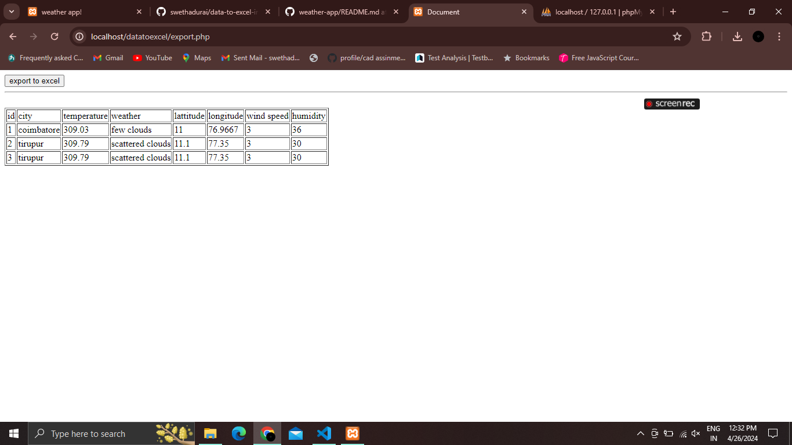
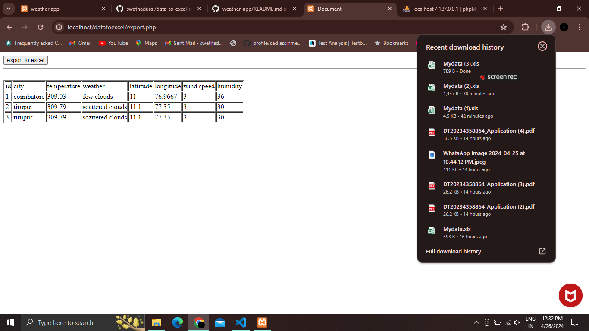
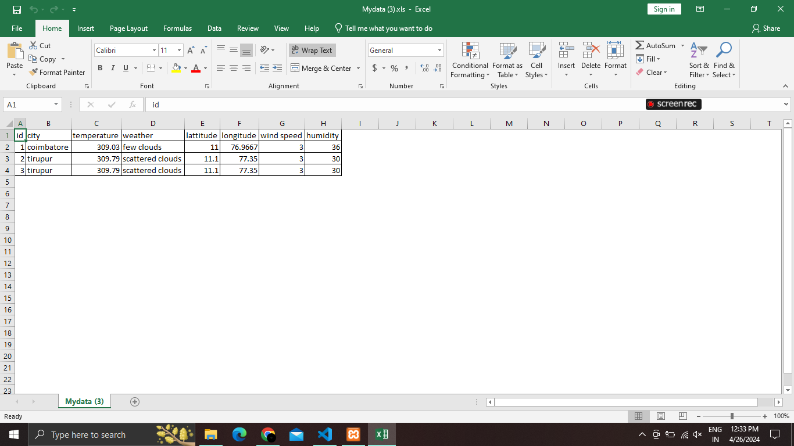

# data-to-excel-in-php

>in this project i have converted the table data into excel sheet and download the excel data
>first i have created a database in phpmyadmin then i connected the database in my project
>then i have created a data table which contain some data initialized "i" and sql query which contain data
>then from for each loop i have seperated single row then converted into table rows
>on clickking the export to excel button it will download the excel sheet - for that i have added some header files

---
output for my project will be like:

<picture>

</picture>
